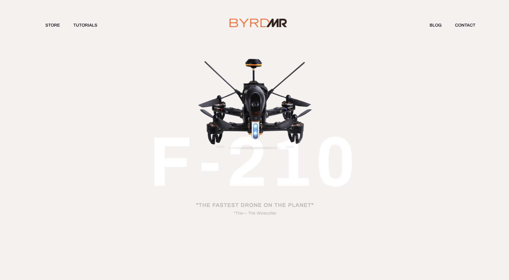
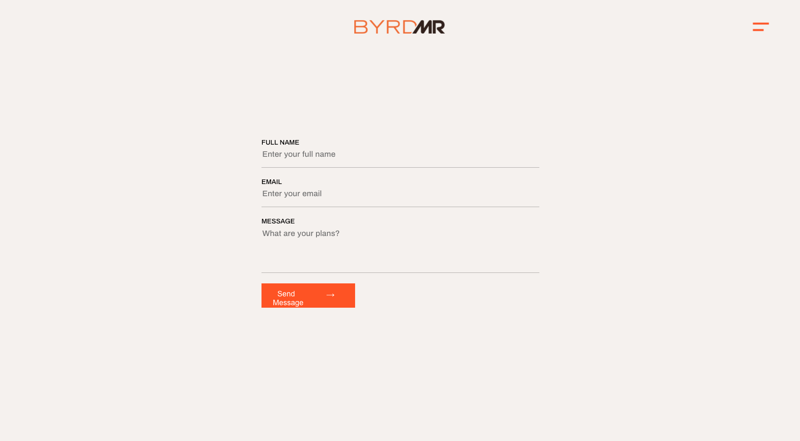

# BYRDMR

## Summary:
A React app for the BYRDMR drone, with two views (and corresponding components): Hero and Contact. See below for more details on what's been done.

## Technologies and packages used:
* React.js (this project was bootstrapped with [Create React App](https://github.com/facebook/create-react-app).)
* CSS
* axios
* Jest (and react-test-renderer)
* react-router-dom


## How to run locally:

* Clone or download the repo
* In the project directory, install dependencies: run `npm i` in Terminal
* Start the development server: run `npm start`
* Navigate in your browser to `localhost:3000` You should see the frontend being served to the browser.
* The page will reload if you make edits.
* You will also see any lint errors in the console.

## How to test locally:

In the project directory, run `npm run test` in Terminal.  

This launches the test runner in the interactive watch mode.\
See the section about [running tests](https://facebook.github.io/create-react-app/docs/running-tests) for more information.  

Please note that although (snapshot) tests have been written, these are currently failing: see below in the 'next-steps and improvements' section for details of why.

## Other scripts

`npm run build` Builds the app for production to the `build` folder.\
See the section about [deployment](https://facebook.github.io/create-react-app/docs/deployment) for more information.

If you aren’t satisfied with the build tool and configuration choices, you can run `npm run eject` at any time. This command will remove the single build dependency from your project.
**Note: this is a one-way operation. Once you `eject`, you can’t go back!**

Instead, it will copy all the configuration files and the transitive dependencies (webpack, Babel, ESLint, etc) right into your project so you have full control over them. All of the commands except `eject` will still work, but they will point to the copied scripts so you can tweak them. At this point you’re on your own.

You don’t have to ever use `eject`. The curated feature set is suitable for small and middle deployments, and you shouldn’t feel obligated to use this feature. However we understand that this tool wouldn’t be useful if you couldn’t customize it when you are ready for it.

## A note on branches
I've built on feature branches, each of which I've merged, via pull requests, into the main branch. Of course, in other circumstances, I would have waited for PRs to be commented on and approved by reviewers. With just me doing this though, I've gone ahead and merged each of my pull requests without it being reviewed by anyone. Although I've merged them into main, I've left the individual feature branches alive (they haven't been deleted).
Please see the closed pull requests for more details.

## The app
### What's been done
#### *Feature: Add view for hero (refered to as '1 Desktop' in Sketch)*
A component `Hero` was made to conditionaly render either the component `HeroDesktopNavbar` or the component `DropdownMenu`, depending on the device's screen width. 

Above 768px, `HeroDesktopNavbar` is rendered, below that width, `DropdownMenu` is rendered instead.

This ultimately allows us to easily match the design sketch and display a Navbar or a dropdown menu, depending on device width. Media rules have also been used in CSS to adjust styling depending on screen width. See the screenshots below:

Above 768px (desktop):


768px and below: 


`HeroDesktopNavbar` is unique to `Hero` (it doesn't appear anywhere else), whereas the `DropdownMenu` can be re-used across most other views in the app.For this reason `DropdownMenu` is included in the folder `components/common/`. 

Using the component `ToggleActive`, the dropdown menu has also been made interactive as shown in the gif below:  


#### *Feature: Add Contact component*

A `Contact` component has been made, containing a form. This is a controlled component, the state of which is updated when a user types in the component's `<input>` or `textarea` fields.  

Screenshot of Contact view:


The component has an (asynchronous) method, `handleSubmit`, which includes some basic error handling and a call to `postMessage`:
```JavaScript
  handleSubmit = async (e) => {
      e.preventDefault()
      try {
        await postMessage(this.state.formData)

        this.setState({
          formData: {
            fullName: '',
            email: '',
            message: ''
          }
        })

      } catch (err) {
        this.setState({ formError: true })
      }
    }
```

The function `postMessage` (in the folder `src/lib`) makes a post request, using axios. As shown below, the function will `console.log` the form data to be posted; however, it will currently return a 404 error, as the url being used doesn't yet go anywhere valid and is simply included here as an example of how the request can be made:
```JavaScript
  export const postMessage = (formData) => {
    console.log(formData)
    return axios.post(`${baseUrl}/messages/`, formData)
  }
```

#### *Routing*
App.js currently contains `Route`s for the `Hero` and `Contact` components. More can be added here in future.

### Testing
Some (relatively crude!) tests have been added for the Hero component and children (in the folder `components/__tests__/`). 
These are simple snapshot tests using Jest. For example, to test that the dropdown renders:

```JavaScript
describe('The DropdownMenu', () => {
  it('renders as expected', () => {
    const tree = renderer.create(<DropdownMenu/>).toJSON()

    expect(tree).toMatchSnapshot()
  })
})
```
As it stands, the tests are currently failing. This is because, in the `MenuAndNavItems` component, we use `NavLink` (imported from react-router-dom node module) to link the list items to other views. Jest currently fails tests with the message ‘Invariant failed: You should not use <withRouter(MenuAndNavItems) /> outside a <Router>’.  

Without using `NavLink` (or adding `Router` around `NavLink`), the tests pass, but this would then mean we don't have appropriate routing in the component.

The test(s) will need to be updated to account for the above — I’m going to look into this further for future!


### Next-steps / improvements:
* Update tests (or possibly the `MenuAndNavItems` component itself) to fix the problem described above which is leading to failing tests
* Lots more testing could be done, including unit tests and component tests, and testing the axios post request
* Error handling in `Contact` can be improved (also potentially to display a message to the user if there has been a problem with form submission)
* Further tweaks to styling; e.g. see 'Other comments' section in this pull request: https://github.com/Simon994/brydmr/pull/1
* Add social media icons in `Contact` to match the Sketch
* Update arrow in form submission button to match the Sketch (would ideally need an icon for this)